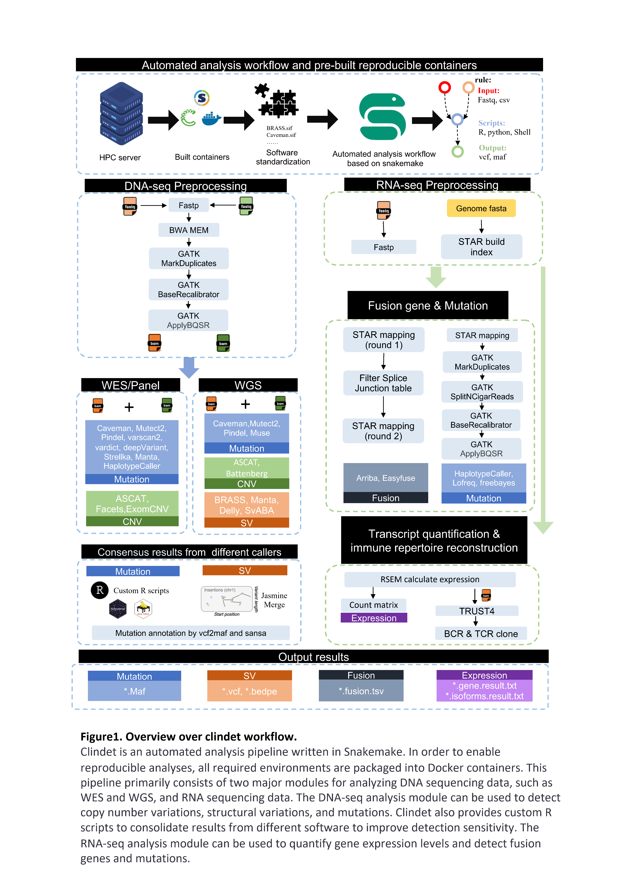

# clindet

clindet is a fully automated multi-omics data analysis pipeline based on Snakemake and singularity. This pipeline enables the analysis of multi-omics data from thousands of patients in cancer cohorts. It can analyze whole-genome, whole-exome, and transcriptome data, and perform commonly used clinical tasks such as gene mutation detection, structural and copy number variation detection, and transcript quantification and fusion gene detection analysis.

# Todo

* scRNA-seq, scATAC-seq analysis workflow
* Mutational signature analysis, driver genes detection,...
* human T2T genome reference support
* ...... 
